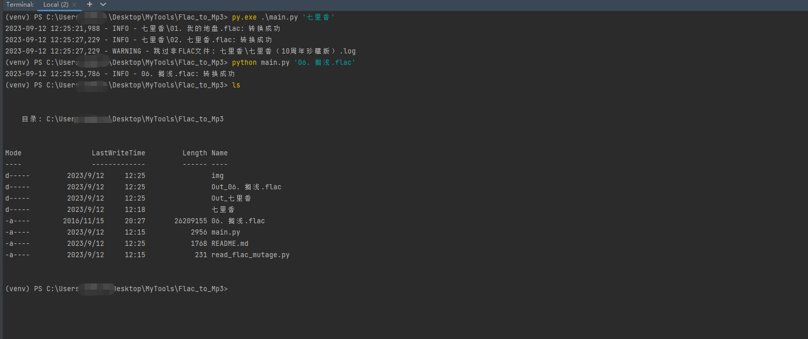

# FLAC 转 MP3
由于某些原因，需要使用到MP3，所以就写了这个工具.

> MP3文件的最高比特率（bitrate）可以根据需要进行设置，但通常的标准比特率有以下几种： 
CBR (Constant Bitrate): 这是一种固定比特率编码，其中每个音频帧都以相同的比特率进行编码。常见的CBR比特率包括 128 kbps（每秒128,000比特）和 192 kbps（每秒192,000比特），但也可以选择其他比特率。CBR通常用于保持音频质量，但会占用更多的存储空间。
VBR (Variable Bitrate): 这是一种可变比特率编码，它根据音频内容的复杂性动态调整比特率。VBR通常可以提供更好的音质，因为它在需要时分配更多比特率给复杂的音频段，而在简单的音频段上使用较少的比特率。常见的VBR设置包括 V0（大约245 kbps的平均比特率）和 V2（大约190 kbps的平均比特率）等。
ABR (Average Bitrate): 这是一种平均比特率编码，它尝试在保持平均比特率稳定的同时，根据音频内容的需要分配比特率。ABR通常提供了介于CBR和VBR之间的折衷方案，可以平衡音质和文件大小。
需要注意的是，MP3文件的比特率越高，音质通常越好，但文件大小也会相应增加。选择适当的比特率取决于您的需求，如果需要高音质，则可以选择较高的比特率，如果需要更小的文件，则可以选择较低的比特率。一般来说，128 kbps或更高的比特率通常提供良好的音质，但对于专业音乐制作或无损音质要求较高的情况，可能需要更高的比特率。


```bash
# 转换单个文件
python main.py '06. 搁浅.flac'

# 转换多个文件
python main.py '七里香'
```
